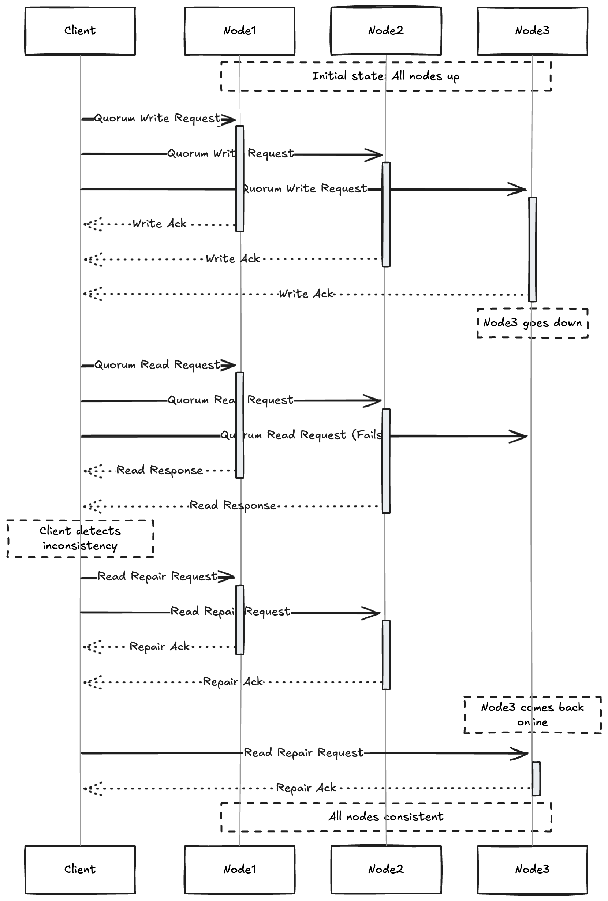

# Leaderless Replication

- Some data storage systems abandon the concept of having a leader and make sure any replicas can accept write from the clients.

- In some leaderless replication client directly sends writes to several replicas while in others a co-ordinator node does this on behalf of the client. However like a leader database the coordinator doesn't 
enforce a particular ordering of the writes.

 ## Writing to the database when node is down

 - Imagine we have three replicas running and one of the replica is down, in case of leader based replication we will be doing a failover depending upon whether the follower node went down or the leader node went down

 - On other hand in a leaderless configuration follower doesnot exist. The client sends the write to all three replicas in the parallel and two replicas accept the write but the unavailable replica misses it.

 - Lets say it is sufficient for two out of three replicas to acknowledge the write after the client has
 received two ok responses. Then the write is succesful 

 

 A quorum write,read and read repair after node outage.

- Read requests are send to all replicas in parallel to solve the problem of stale read . the client may get different responses from different nodes the uptodate value from one node and stale value from another , Version numbers are used to determine which is newer.

## Read repair and Anti-entropy

- The replication system must ensure that eventually data is copied to all replica, After an unavailable node comes online how does it catch uo with the writes it missed?

- Two mechanisms are used in **Dynamo-Style** datastores

**Read repair**: When a client makes a read from several nodes in parallel , it can detect any stale responses.
For example a user gets a version 6 value from replica 3 and version 7 value from replicas 1 and 2. The client see that replica 3 has a stale value and writes the newer value back to the replica. This approach works well for the values that are frequently read.

**Anti Entropy process**: In addition , some datastores have a background process that constantly looks for differences in data between replicas and copies any missing data from one replica to another. Unlike the replication log in leader-based replication , this doesn't copy writes in signinficant order and there may be a significant delay before data is copied.

## Quorums for reading and writing

- If we know that every write is guaranteed to be present on atleast two of three replicas that means at most one of the replicas can be stale.

- If we read from the atleast two replicas we can be sure that alteast one of the two is upto date. 

- If the replica is down or slow to respond, reads can neverthless continue returning an up-to-date value.

- If there are **n** replicas , every write must be confirmed by **w** nodes to be considered succesful and we must query atleast **r** nodes for read. (In our example n=3,w=2,r=2).

- As long as **w+r>n** we expect to get upto date value when reading, because atleast one of the r nodes we
are reading must be upto-date.

- Reads and writes that obey these r and w values are called **quorum** reads and writes.

- We can think of r and w as min number of votes required for read and write to be valid.

- In Dynamo style databases , the parameters , n ,w and r are typically configurable.

- A common choice is to make n an odd number  (typically 3 or 5) and set w=r=(n+1)/2.

- For example a workload with few writes and many reads may benefit from setting w=n=r=1. This makes read
faster but has disavantage that one failed node causes all database writes to fail

The quorum condition ``w+r > n`` allows the system to tolerate unavailable nodes as follows

- If w < n we can still  process writes if node is unavailable.

- If r <  n we can still process reads if node is unavailable.

- With n=3,w=2, r=2 we can tolerate one unvailable node.

- With n=5, w=3, r=3 we can tolerate two unavailable nodes.

