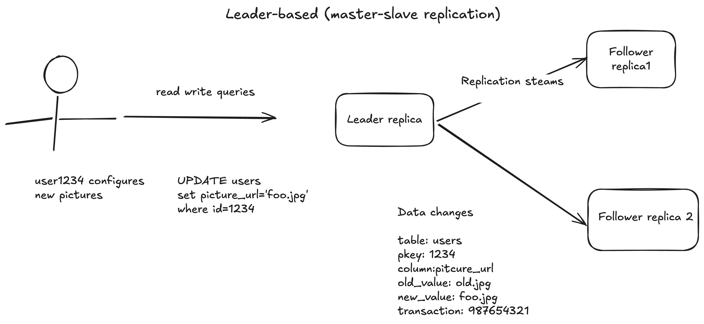

# Leaders and Followers

- Each node that stores a copy of database is called **replica**

- Every write to the database must be processed by every replica, otherwise the replicas would no longer contain same data.

- The most common soultion is **Leader based replication** (Also know as active/passive or master slave replication).

## Working

- One of the replica is designated as the **leader** (also known as **master** or **primary**).

- When client wants to write data they send request to the leader which in turn writes it to own local-storage first.

- The other replicas known as **followers** (read replicas , slaves ,secondaries or hot standbys). Whenever a leader writes new data to its local storage it also sends the data change to all of its followers as part of **replication log** or **change stream**.

- Each follower takes log from the leader and updates it local copy accordingly , By replying the writes in same order as processed by the leader. 

- When client wants to query data , it can query any one of the followers but writes are processed only by the leader.

