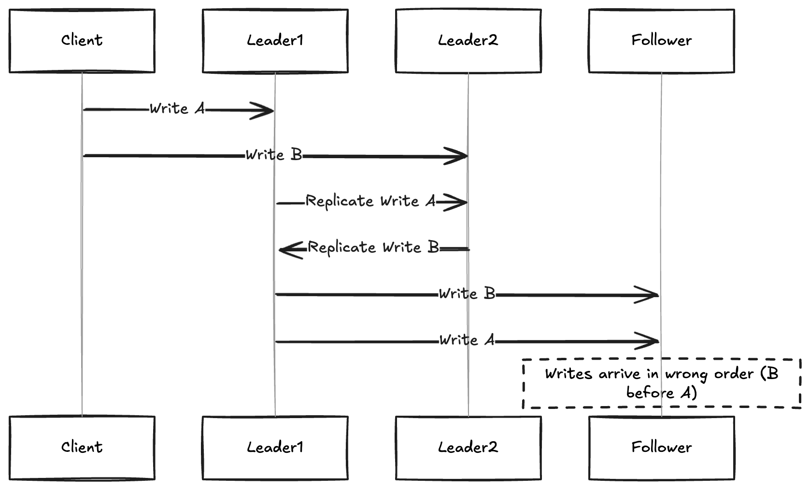

# What is Conflict? 

- Some kinds of conflict are obvious, Two writes concurrently modified the same
field and same record , setting it to two different values.There is little doubt
than this is a conflict.

# Multi-Leader Replication Topologies

- A **replication topology** describes the communication paths along which writes are propogated from one node to another.

- If there are two leaders L1, L2 , there is only one way to propogate writes, 
Leader L1 must send all writes to L2 and viceversa. With more than two leaders various topologies are possible

- Circular Topology
- Star topology
- All to all topology

- The most general topology is **all-to-all** in which every leader sends it writes to every otuer leader.

- However more restricted topologies are used for MYSQL by default support only a circular topology , in which each node forwards those writes plus any of writes to another node.

- Another popular topology is **start** one designated root node forwards write to all of the other nodes. The star topology can be generalized to a tree.

- In circular and star topology a write may need to pass through several nodes before it reaches all replicas. Therefore node need to forward data change they receive from other nodes.

- To prevent infinite replication loops each node is given a unique identifier and the replication log,each write is tagged with identifiers of all the nodes it has passed through. When a node receives a data change
that is tagged with its own identifier, the data change is ignored, becuase the node knows it has already been processed.

- A problem with star and circular topology is that if one node fails it can interrupt the flow of replication messages between other nodes, causing them to unable to communicate until node is fixed. 

- The topology can be fixed to work with other nodes , but most of the time it is manual.

- The fault tolerance is high for densely connected topology like **all-to-all** because it allows messages
to travel along different paths.

- All-to-all topologies have issues too. In particular some network link may be faster than others (due to network congestion) with the result that some replication message may over take other.

