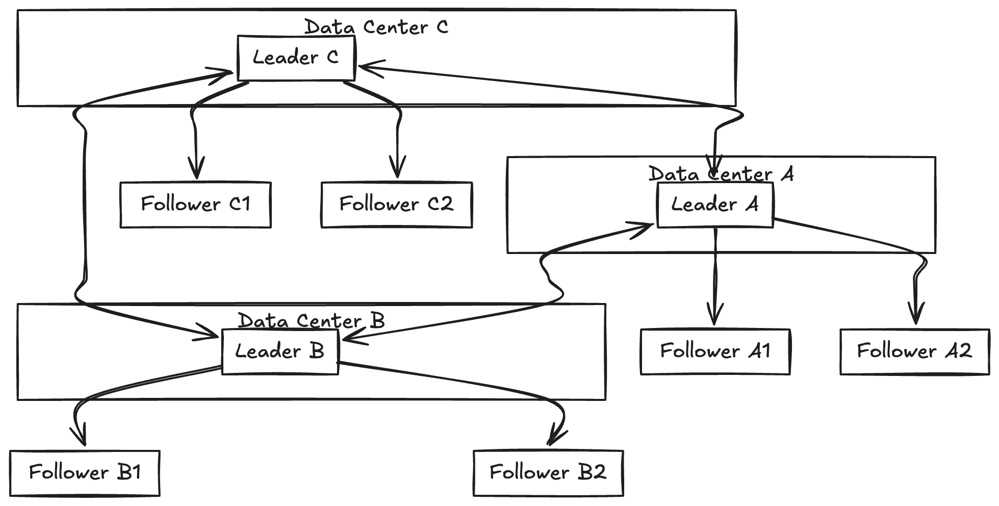

# Multi Leader Replication

- Leader based replication has one major flaw, All writes go through a single leader, if the leader node goes down writes are blocked.

- Extension of this model is to allow more than one leader to accept writes.

- Replication still happens the same way each node that processes a write must forward the data change to all other nodes. 

- This is known as **multi-leader,master/master or active/active** replication

- Each leader simultaneoulsy acts as follower to other leaders.

## Single-leader and Multi-leader configurations in a multi-data-center deployment

## Performance

- In a single-leader configuration every write must go over the internet to data center with leader, This can add significant latency to writes
and might contravene the purpose of having multiple datacenters.

- In a multi-leader configuration every write can be processed in the local datacenter and replicated asynchornously to
other data centers.

- Thus inter datacenter network delay is hidden from the user thus increasing overall latency.

## Tolerance of datacenter outages

- In single leader configuration if the datacenter with leader , failover can promote another follower in a datacenter
to be leader.

- In multi leader configuration each data center can operate independently of others and replication catches up
when failed datacenter comes back online.

## Tolerance of network problems

- Traffic between datacenters goes over public internet which may be less reliable than local network 
within a datacenter.

- A single leader configuration is very sensitive to problems within inter-datacenter link because writes are made
synchornously over this link. A multi leader configuration with usually network problems can tolerate better.

## Disadvantages of multi leader replication

- Same data might be concurrently modified in two datacenters and those write conflicts must be resolved
(conflict resolution)

- Auto-incrementing keys, triggers and integrity constraints

## Clients with offline operation

- Another situation where multi-leader replication is appropriate is if we have an application that needs to
continue work while it is disconnected from the internet.

- Consider apps like Calendar in phone , we are able to create events when it is offline,  the data syncs
with the remote when the connections is back

- Every device has a local database that acts as a leader (accepts write requests)  and there is asynchornous multi-leader
replication process , between the replicas of the calendar and other devices.

- The replication lag depends on internet availablity

- It is essentially same as multi-leader replication between data centers. each device is a **datacenter** and network
connection between them is extremely unreliable. 

- **CouchDB** is designed for mult leader replication purpose.

## Colloborative Editing

- Realtime Colloborative apps like Google docs allow multiple people to concurrently edit a text document.

- When one user edits a document the changes are instantly applied to their local replica (the state of doc in
the webbrowser or client application) and asynchornously replicated to the server and any other users who
are editing the same document.

- One way to handle this is to obtain lock on the document before user can edit it, If another user wants
to make edit they obtain a lock on that document and edit. This is equivalent to single leader replication with txns
on leader.

- If we need to provide more seamless experience by avoiding locking we need to discuss on how to handle write 
conflicts.

# Handling Write conflicts

- The biggest problem with multi-leader replication is that write conflucts can occur which means the conflict
resolution is required.

- For example, consider a wiki page that is simultaneoulsy being edited by two users,  User 1 changes the 
title of page from A to B and user 2 changes the title from A to C at the same time.

- Each user's change is successfully applied to the leader. However a change is async replicated and
conflict is detected.

- The problem does not occur in a single leader database.

# Synchornous vs asynchornous conflict detection

- In a single-leader database, the second write will be either block and wait for the first write
to complete or abort the second write txn , forcing the user to retry write.

- On the other hand in multi-leader setup , both writes are successful and the conflict is only detected
asynchornously at some later point in time. At that time it may be too late to resolve the conflict.

- In principle we can make the conflict detection synchornous, wait for write to replicated to all replicas
before telling the user that the write was successful. However we lose the main advantage of multi-leader
replication. allowing each replica to accept writes independently.

- If synchornous conflict replication is required we can use single-leader replication.

# Conflict avoidance

-  The simplest strategy to deal with conflicts is to avoid them. 

- If the application ensures that all writes for an record go through a same leader then the conflicts cannot
occur.

- Since many implementations of multi-leader replication handle  conflicts quite poorly avoid recommending
approach.

- In an application where a user can edit their own data , you can ensure that requests from a particular user
are always routed to same datacenter and use the leader in datacenter for reading and writing.

- Different users may have different home datacenters but in users point of view the configuration is frequently
recommend approach.

- However the user sometimes want to change the designate leader for a record perhaps one datacenter has failed
and you need to reroute traffic to another datacenter or perhaps the user has moved to different location and it now
closed to a different datacenter. In this situation conflict avoidance breaks down and you have to deal with the 
possibilty of concurrent writes on different leaders.

# Converging towards a consistent state

- A single leader database applies writes in a sequential order , if there are several updates to the same field
the latest write determines the  final value of the field.

- In a multi-leader configuration there is no defined ordering of writes, so it is not clear what final value should be

- Neither order is more correct than the order 

- If each replica simply applies the write in order that it saw the writes, the database would end up in an
**inconsistent state**.

- Every replication system must ensure that data is eventually the same all replicas. Thus the database must
resolve the conflict in a **convergent** way which means all replicas must arrive at the same final value when
all changes have been replicated.

## Ways for achieving convergent conflict resolution

- Give each write a unique ID (eg. a timestamp, a long random number , a UUID or hash of the key and value), 
pick the write with highest ID as the winner and throw away other writes, if a timestamp is used this technique
is known as **Last Write Wins**(LWW) although this approach is popular this is dangerously prone to data loss.
 
- Given each replica a unique ID and let writes originated at higher number replica always take precedence over
lower number replica. This implies data loss.

- Record the conflict in an explicit data structure that preserves all information and write application
code that resolves conflict at some point in time (prompting the user).

## Custom Conflict resolution logic

- As the most appropriate way of resolving conflict may depend on the application .

**On write**

- As soon as the database system detects a conflict in the log of replicated changes it calls the conflict
handler. 

**On read**

- When a conflict is detected all the conflicting writes are stored, The next time data is read these multiple 
versions of data are returned to the application. The application may prompt the user or automatically resplve the conflict
and write the result back to DB. 

- Conflict resolution applies at the level of individual row or document not for an entire transaction.
Thus if we have a transaction that atomically makes several different writes, each write is still considered
seperate for purpose of conflict resolution.

## Automatic Conflict resolution

- Conflict resolution rules can be quickly become compicated and custom code can be error prone.

- Amazon is frequently cited example of surprising effects due to a conflict resolution handler, for some time
the conflict resolution logic on the shopping cart would preserve items added to the cart , but not items
removed from the cart.

- Thus customer sees items reappearing in cart even though they had previously removed.

- **Conflict-free replicated datatypes (CRDTS)** are family od data structures for sets, maps(dictionaries) ordered list,
counters etc can be concurrently edited by multiple users and which automatically resolve conflicts in sensible
ways.

- **Mergeable persistent data structures** track history explicitly similarly to Git version control system and use a 
three way merge.

- **Operational Transformation** is the conflict resolution algorithm behind collobarative editing 
applications such as Google Docs.
