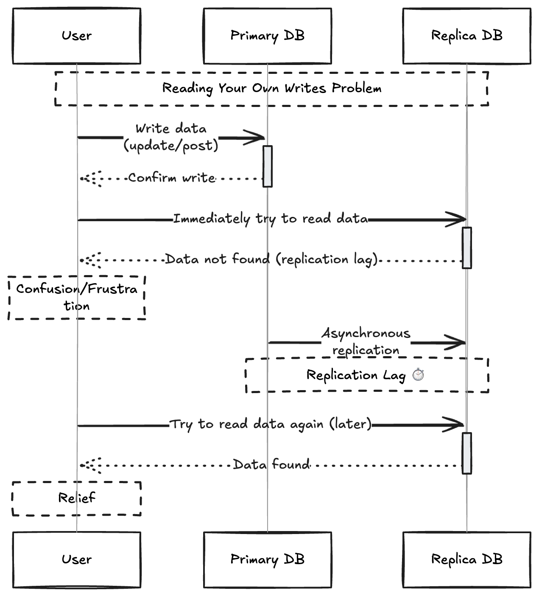

# Problems with replication log

- Being able to tolearte node failures is the one of the reason for wanting replication.

- Leader-based replication needs the writes to go through a single node , but reads can go to any replica. 

- For **read-heavy** workload it is a common pattern to create multiple followers and divert this read across these nodes to reduce the load on the leader.

- In read-scaling arch we can handle load by increasing the follower nodes, This approach realistically works only with **asynchornous-replication**. In synchornous replication it will be likelier for all nodes will be unavailable for writing.

- Unfortunately if an application reads from any **asynchornous follower** , it may see outdated information if the follower has fallen begin . 

- This leads to inconsistencies in the database , if we query both on leader and follower we will get different results because all writes have not been reflected in the follower.

- The inconsistency is just a temporary state if the leader stops transferring data to the follower it might catch up with the leader. This is known as **eventual consistency**.

- The term eventually is deliberately vague , there is no limit to how far a replica can fall behind. 

- In normal op , the delay betwen write happening on a leader and reflecting in  a follower (replication lag) is just fraction of second.

- If system is operating in capacity or the network lag is higher it may extend to several seconds.

- When the lag is high the inconsistencies it introduces are major. 

## Reading your Own writes

- Many applications let the user submit some data and then view what they have submitted.

- This might be a record in customer db , comment.

- When the new data is submitted, it must be sent to the leader, but when the user views a data it can be read from the follower.

- If the user views data shortly after making a write , the new data might not have reached the replica

- In this situation we need **read-after-writes** consistency known as **read-your-writes** consistency.

- This is guaranteed that when user reloads a page or requests data they submitted they can always get that data. There is no guarantee on data submitted by others.

## Implementing read-after-writer in leader-base replication

- When reading something the user may have modified read it from the leader ,else from the follower. For example to read profile data in a social network there is no way the data is modified other than the owner,So always read the profile data from the leader.

- If most things are potentially editable by user , it is inefficient to read everything from the user thus eliminating the need for replication , In this case we can use other criteria to check whether we have to read it from the leader, like the last update time , after 1 min of last update read from the leaders and rest from the follower. This lag can be adjusted based on the patterns.

-  The client can remember the last updated timestamp so that the replica can serve only latest data from the last uopdate time. if replica is not sufficiently upto date the data can be handled by another replica or the query can wait until the replica has caught up.

- The timestamp could be **logical timestamp** something that indicates the order of writes such as log sequence number.
