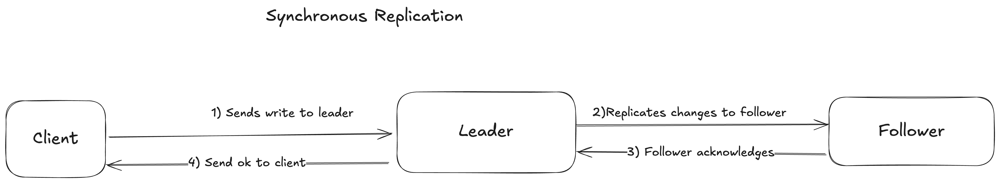
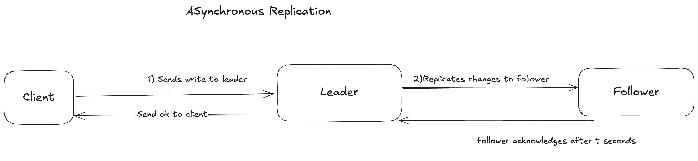
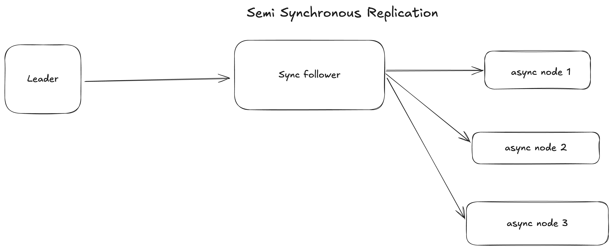

# Synchornous Vs Asynchornous Replication

- An important detail of replicated system is whether the replication happens **synchornously or asynchornously**.

- In relational DB this is a configurable option other systems are hardcoded to be either one or other.

## Synchornous Replication

- The leader waits until the follower has confirmed that it received the write before reporting success to the user and before making  write visible to other clients

- Normally replication is quite fast most database systens apply changes to follower quickly, but there is no guarantee on how long it might take. 

## Advantages

- The follower is guaranteed to have upto date copy of data that is consistent with leader.

## Disadvantages

- The leader is blocked due to failures happening in the follower node and leader cannot process write until the replica is back agin.

## Asynchornous Replication

- The leader sends changes to the follower but doesn't wait for response

## Advantages 

- Writes can be processed independently without relying on follower.

## Disadvantages

- Followers might not be upto date and can have replication log

## Semi-Synchornous

- In practice if we enable synchornous replication one follower is synchornous and others are asynchornous.

- If the sync follower becomes unavailable or slow one of the async follower is made synchronous that guarantess two have upto date date on atleast two nodes

- Often leader based replication is configured to be completely asynchornous. In this case if leader fails and is not recoverable any writes that have not yet been replicated to followers are lo. 

- This means a write is not guaranteed to be durable even if it has been confirmed to the client. 

