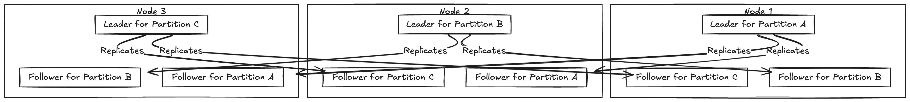

# Partitioning and Replication

- For very large datasets or very high query throughput replication alone is not
sufficient , we need to break the data up into ``partitions`` also known as ``sharding``

- Partitions are defined in such a way that each piece of data (each record) belongs to excatly one
partition.

- In effect  each partition is a small database of its won , although database may support operations that
touch multiple operations at same time.

- The main reason for wanting to partition data is **scalability**. Different partitions can be placed on a different nodes in a shared nothing cluster.

- For queries that operate on a single partition each node can independently execute queries on its own partition so query throughput can be scaled by adding more nodes. Large complex queries can be parallelize across many nodes.

- Partitioning is usually combined with replication so that copies of each partition are stored on multiple nodes.

- This means that even though the record belongs to a simple partition it can be stored in multiple nodes.

- A node may store more than one partition . Each partitions leader is assigned to one node and its follower are assigned to another nodes. Each may be the leader for some partition and follower for some partition

# Partitioning of Key Value data

- Goal with partitioning is to spread data and query load evenly across nodes.

- If every node takes a fair share then in theory 10 nodes should be to handle 10 times as much data and 10
times the read and write throughput of a single node.

- If partition is unfair so some partitions have more data or queries than others it is called **skewed**

- The presence of skew makes partitioning less effective. all the load could end up on one partition so 9 out of 10 nodes are idle and bottleneck is the single busy node.

- A partition with high load is called **hotspot**.

- The simplest way to avoid hotspot is to assign data to node randomly. But it has disadvantage when querying data we dont know which partition data is and need to do parallel query.

# Partitioning by Key Range

- On way of partitioning is to assign a continous range of keys (from some min to max ) to each partiotion .

- If we know the boundaries between the ranges we can easily find which partition contains a given key.

- If we also know which partition is assigned to which node we can make request directly to the 
appropriate node.

- The range keys are not necessarily evenly space because data may not be evenly distributed. 

- With each partition we can keep keys in sorted order. This has advantage that range scans are easy and we can treat
the key as concatenated index in order to fetch several related records in one query. 

- Consider a application that stores data from network sensors where the key is timestamp of the measurement.Range
scans are very useful , tehy let easily to fetch all the reading from a particular month

## Downside of Partitioning by keyrange

- Certain access patterns can lead to hotspot. If the key is timestamp then the partitions correspond to ranges 
of time ,  We partition based on today , If we are writing data for today the current day partition becomes busy
where as the rest becomes idle.

- To avoid this problem instead of using timestamp we can prefix the sensor_name so that the data for particular 
sensor is only fetched and writes are more evenly distributed.

## Partitioning by Hash of key

- Because of the risk of skew and hotspots, many distributed datastores use a hash fn ti determine the partition
of a given key.

- A good hash fn takes skewed data and makes it uniformly distributed , Say we have 32-bit hash fn that takes
a string , whenever you give it a new string, returns a seemingly random number between 0 and 2**32-1. Even if the input
strings are very similar , the hash is distributed evenly across the range of numbers.

- For partitioning purposes, the hash fn need not be cryptographically strong. For example MongoDB uses MD5
Cassnadra uses Murumur3.

- Once we have suitable hash function for keys, we can assign each partition a range of hashes and every key 
whose hash falls within a partitions range, will be stored in the partition.

- This technique is good at distributing keys fairly among partitions, The partition boundaries can evenly spaced
and choosed pseudorandomly.

