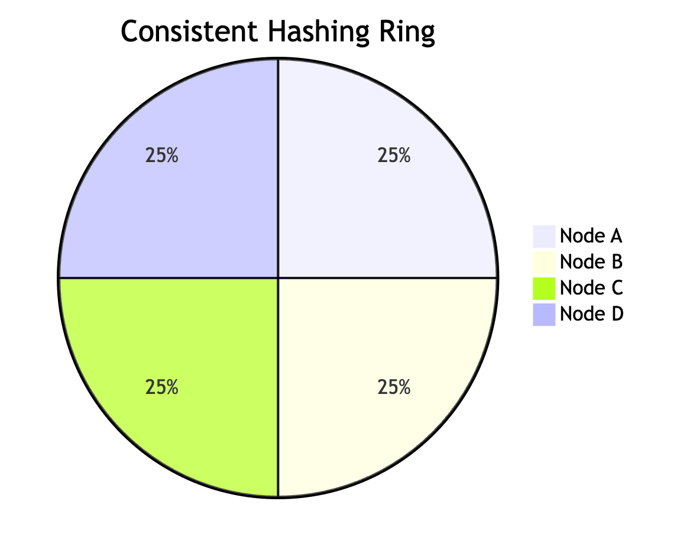

# Consistent Hashing

- Consistent Hashing is a distributed hashing scheme that operates independently of the number of servers or objects in a distributed hash table. It powers many high-traffic dynamic websites and web applications.

# Hash Function

-  A hash function is  a function that maps a piece of data typically some kind
of object of arbitary size to another piece of data typically to an integer known as hash code or simply hash.

- Hash functions have many uses and for each one, different properties may be desired. There is a type of hash function known as cryptographic hash functions, which must meet a restrictive set of properties and are used for security purposes—including applications such as password protection, integrity checking and fingerprinting of messages, and data corruption detection.

- Non-cryptographic hash functions have several uses as well, the most common being their use in hash tables

## Distributed hash function

- Lets say we have a distributed memort caching system like (Memcached)[https://memcached.org/].

- We will decide which server the data goes by using a simple naive algorithm like ``hash(key) mod N`` , where N is the number of servers.

- This algorithm works well the number of server N is constant what if we add /remove servers then most part of the data will be missed out of cached.

- So when the request hits it will be a cache miss and the code needs to go to the source to fetch the data and put it back in the cache thereby adding load to the database server.

- To solve this problem entry **Consistent Hashing**

## Consistent Hashing

- Consistent hashing is a distributed hashing scheme that operates independently
of number of objects in a distributed hash table by assigning them a position on abstract circle or hash ring.This allows servers and objects to scale without affecting the overall system.

- Imagine we mapped the hash output range onto the edge of a circle. That means that the minimum possible hash value, zero, would correspond to an angle of zero, the maximum possible value (some big integer we’ll call INT_MAX) would correspond to an angle of 2𝝅 radians (or 360 degrees), and all other hash values would linearly fit somewhere in between. So, we could take a key, compute its hash, and find out where it lies on the circle’s edge.

