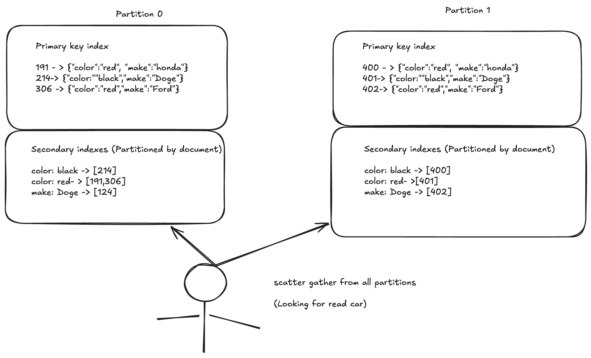

# Partition and Secondary Indexes

- A secondary index usually doesn't identify a record uniquelty but rather is a way of searching the occurences of particular value like actions by user123, car with color red etc.

- The problem with secondary indexes is that they don't map neatly to partitions. There are two main approaches to partitioning a database with secondary indexes
     - Document based partitioing
     - Term based partitioning

---

# Partitioning Secondary Indexes by document

- Lets say wer are operating a website for selling cars , Each listing has a unique ID called ``document ID ``and the document is partitioned based on the documentID (Eg IDS 0-499 , Partition 0 , IDS 500-999 in partitiion 1) etc

- Want to let users search for cars allowing them to filter by color and make so we need a **secondary index** on color and make (in document db these are fields in relational db these are columns).

- In this indexing approach each partition is completely seperate each partition maintains its own **secondary indexes** covering only the documents in that partition.  It doesnt care what data is stored in other partition.

- CRUD is only needed to be handled in that particular partition that contains the document ID we are dealing with.

- For this reason document partitioned index is also known as **local index**.

- The approach to querying a partitioned data is sometimes known as **scatter/gather** and it can make read queries on secondary index quite expensive.

-  It is recommended to design our partition in such a way that the secondary indexes queries are supported from a single partition.

---

# Partitioning Secondary Indexes by term

- Rather than each partition having its own secondary index (local index) we can construct a ``global index`` that covers data in all partitions.

- However we cannot store the data index in one node since it become a bottleneck and defeat the purpose of partitioning.

- A global index must also be partitioned but differently from primary key index

- We can put letters a to r in partition 0 and s-z appear in partition 1. 

- This index is called **term-partitioned** because the term we are looking determines the partition of the index. 

- As before we can partition the index by term itself or using a hash of the term. Partition by term itself can be useful for range scansb where as partitioning on hash of the term gives a more even distribution of load.

- The advantage of global termed partition index over a document partitioned index is that it can make reads more efficient rather than doing scatter gather over all partitions we need to make request to partition containing the term that it wants, However the downside of the global index is that writes are
slower and more complicated because a write to single document may affect mulitple partitions of index.

- Index updating happens asynchornously 

---

## Rebalancing Partitions

- The process of moving load from one node in the cluster to another is called **rebalancing**

- No matter which partitioning scheme is used rebalancing is usally expected to meet meet some minimum requirements

- After rebalancing the load (CRUD) should be shared fairly between the nodes in the cluster.

- While the rebalancing is happening the database should continue accepting reads and writes.

- No more data than necessary should be used between nodes to make rebalacing fast to minimize network and disk I/O load.

