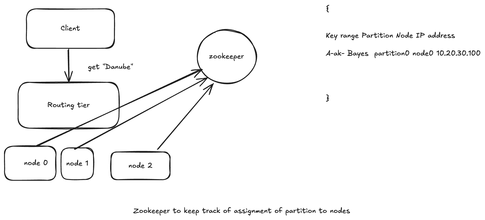

# Request Routing

- Partition is done across multiple nodes running on multiple machines. 

- When a client wants to make a request how does it know which node to connect to.

- As partitions are rebalanced the assignment of partitions to node changes. 

- This is an instance of more general problem called **service discovery** .

- Any piece of software that is accesible over a network has this problem especially if aiming for high availability .

## High level solving

- Allow clients to contact any node(eg via round robin balancer). If the node coincidentally owns the partition to which the request applies, it can handle the request directly otherwise it forwards the request to appropriate nodes, receives the reply and passes the reply along to the client.

- Send all requests from client to a routing tier first which determines that which node should handle each requests and forwards it accordingly. The routing tier doesnot handle any requests it acts as **partition-aware load balancer**.

- Requires the clients be aware of the partitioning and the assignment of partitions to nodes. In this case a client connect directly to appropriate node without any intermediary.

- Many distributed data systems rely on a seperate cordination service such as **Zookeeper** to keep track of the cluster metadata

