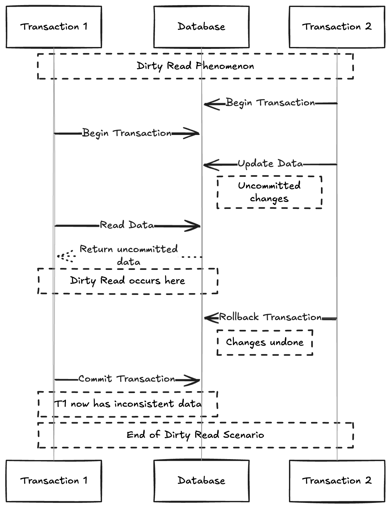

# Single-Object and Multi-Object Operations

- If we are talking about Atomicity and Isolation it is assumed that we want to modify several objects (rows ,documents) at once.

- Such multi-object transactions are often needed if several pieces of data need to be kept in sync.

- For example lets take a query to view all unread emails for user

```sql
    SELECT COUNT(*) FROM emails where recipient_id=2 AND unread_flag = true
```

- We find this query to be too slow if there are many emails and decide to store the number of unread messages in a seperate field (kind of denormalization). Now if new message comes we need to increment the unread counter as well and whenver message is marked as read we need to decrement the counter.





## Single-object writes

-  Atomicity and Isolation also applies when a single object is being changed. For example if we are writing a 20KB JSON document into database
    - If the network connnection is interrupted after first 10kb we have sent does the database store the 
    unparseable 10KB fragment of JSON

    - If the power fails when the DB is middle of overwriting the previous value on disk do we end up with new and spliced together

    - If another client reads the doc while write in progress will it see a partially updated value?

- Atomicity can be implemented using log for crash recovery and isolation can be implemented using lock on each object (allowing only one thread to access an object at any one time).

- Some databases also provide more complex atomic operations such as increment op which removes the need for a **read-modify-write** cycle.

