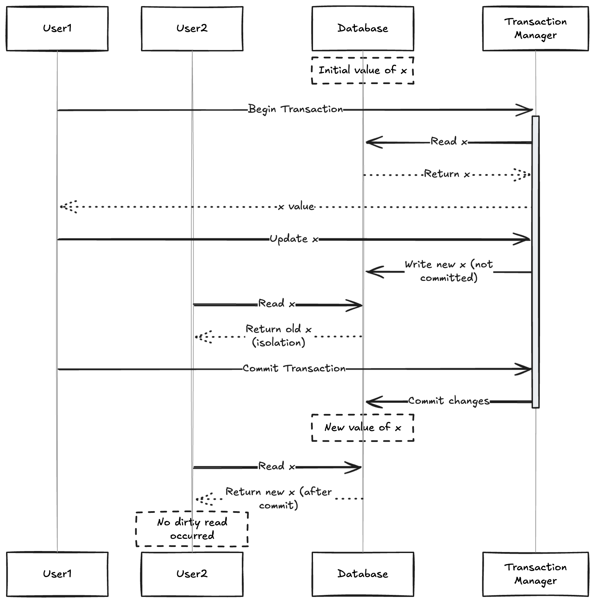

# Read Committed

- The most basic level of transaction isolation is **read-committed**. It makes two guarantess
    - When reading from database we will see only the data that has been commited (no dirty reads)
    - When writing to the database we will overwrite data that has been commited (no dirty writes)

---
## No dirty reads

- If a transaction has written some data to database a but the txn is not committed or aborted , if another txn can see the uncommited data that is called as **dirty read**

- Transanctions running at read-committed isolation level must prevent dirty reads.

- This means that any writes done  by an txn becomes visible to other txn only after the txn commits.

- Read uncommitted prevents dirty writes but not dirty reads.

- There are few reasons why it is useful to prevent dirty reads
    - If txn needs to update several objects a dirty read means that another txn may see some of the updates but not other. 

    - If txn aborts any write it has made neded to be rolled back , This means that txn see data that is rolled back in future.

---

## No dirty writes

- When two transactions concurrently try to update the same object in a DB we dont know the order of writes.

- There is a possibility that one txn writes and commits and other txn writes an uncommited value , This is called **dirty write**

- Transactions running at read committed isolation level must prevent dirty writes usually by delaying the second write until the first write txn has committed or aborted.

- By preventing dirty writes , this isolation level avoids some kind of concurrency problem

     - If txn update multiple objects , dirty writes can lead to bad outcome.

- Most commonly database prevent dirty writes by using row level locks , when a transaction wants to modify particular object (row or document) it must first acquire a lock on that object. The lock must be held until the transaction is committed or aborted.

- Only one transaction can hold the lock until the transaction is committed or aborted.If another transaction wants to write to the same object it must wait until the first transaction is committed or aborted before it can acquire the lock and continue.

- Preventing dirty reads, one option would be to use same lock and to require any txn that wants to read an object to breifly acquire the lock and release it immediately after reading. This ensure read doesnt happen when an object has dirty uncommited value.

- However the approach of requiring read locks doesnot work well in practice, because on long running write txn can force other txn to wait until the long running txn has completed even if other txn only read and donot write anything to db.

- This harms the repsonse time of read-only txn and it is bad for operability.

- Usually old value is stored until the new value is commited , Old value is served before commiting and new value is served after committing.

