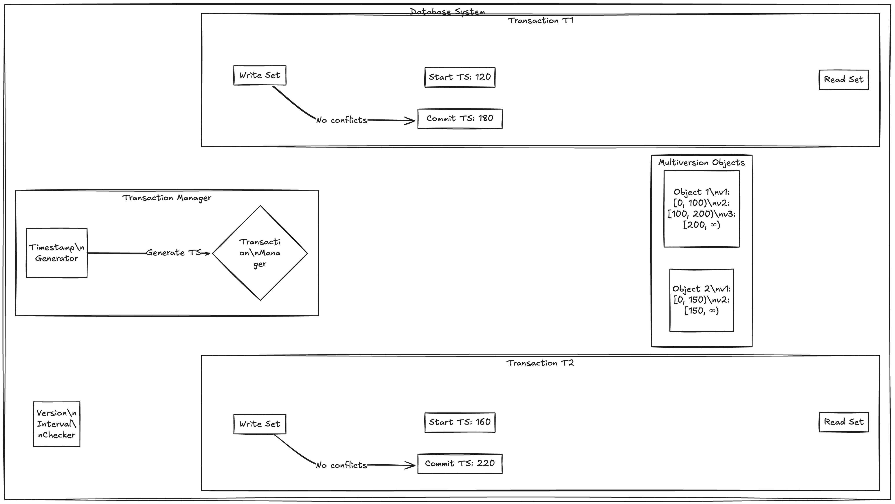

# Snapshot Isolation and Repetable Read

- It seems like Read commited isolation level  is perfect for preventing all the concurrency issues but we run into issues like **Read Skew**.

## Read Skew
- Read skew is a phenomenon in distributed systems, particularly in databases, where a read operation observes inconsistent or stale data due to concurrent writes. It is a type of consistency anomaly that can arise in systems with weak consistency models.

- Read skew occurs when:

    - A transaction reads data that is being concurrently modified by another transaction.
    -  The data read may not reflect a consistent snapshot of the database.

-  Alice has $1,000 of savings at a bank split across two accounts with $500 each . Now a txn transfers $100 from one of her accounts to the other. 

- If she looks at the balance at the same moment when the txn is happening she may see one account balance at a time before the incoming payment has arrived (with a balance of $500) and other account new balance being $400 .

- To alice it appears that only has $900 in the accounts.

- This anomaly is called **read skew** and example of **nonrepeatable read**
. If alice were to read the nalance of account again at the end of txn she would see a different value $600 than she saw in the previous query. 

- Read skew is acceptable since we are reading only commited data. In this case we will see consistent data after we reload the data.

- However some situations cannot tolerate such temporary inconsistency

**Backups**: Taking a backup requires making a copy of the entire database which may take  hours on large database. During the time when the backup process is running writes will be continued to be made to the database. Thus we could end up with some parts of backup containing older version of data and other with a newer version. If you need to restore from such a backup the inconsistencies become permanent.

**Analytic Queries and integrity checks**: Sometimes want to run a query that scans over large parts of database, such queries are common in analytics. These queries return different results if we observer database at a different points of time.

---

## Snapshot Isolation

- Snapshot Isolation is an idea that each txn reads from a consistent snapshot of database.

-  The transaction sees all the data that was commited in the database at the start of txn. Even if the txn is subsequently changed by another txn. Each txn sees only the data from the particular point in time.

- Snapshot isolation is a boon for long running read-only queries such as backup and analytics.

## Implementing snapshot Isolation

- Like read committed isolation implementation of snapshot isolation use **write locks** to prevent dirty writes which  means a txn that makes a write can block the progress of another txn that writes to the same object. Read doesn't require any locks.

- A key principle of snapshot isolation is readers never block writers and writers never block readers.

- This allows a database to handle long running read queries on a consistent snapshot at the same time as processing writes normally, without any contention between two.

- The database must potentially keep several different committed versions of an object ,because various inprogress txn must need to see state of db at different points in time.

- Since it maintains different object versions side by side it is known as **Multi-Version Concurrency Control (MVCC)**.

- Read committed also implemented using mvcc only where read committed sees the latest data.

- When a txn is started it is given a unique always increasing transaction ID (txid). Whenever a txn writes anything to the database, the data it writes is tagged with the txn id of the writer.

- Each row in a table has a **created_by** field containing the ID of the txn that inserted the row into the table.

- Each row has **deleted_by** field which is initially empty when a txn deletes the row, the row is not actually deleted, but it is marked for deleting by setting the **deleted_by** field to the ID of the txn requested the deletion.

- At some later point in time when it is certain no txn can access the deleted data , a garbage collection process removes the row marked for deletion and frees uo the space.

## Visibility rules for observing consistent snapshot

- When a txn reads from db the txid is used to decide which objects it can see and which are invisible. 

- By defining visibility rules the db can present a consistent snapshot of db to the application.

## Working

- At start of each txn the db makes a list of all the other txns that are in progress (not yet committed or aborted) at that time. Any writes those txn has made are ignored even if the txn commits.

- Any writes made by aborted txns are ignored.

- Any writes made by txn with a later txn id are ignored regardless of commit status.

- All other writes are visible to app queries.

Any object is visible if both of the following conditions are true

- At the time when the reader txn started, the txn that created the object had already committed.

- The object is not marked for deletion of if requested for deletion not commited at the time when the txn started.

