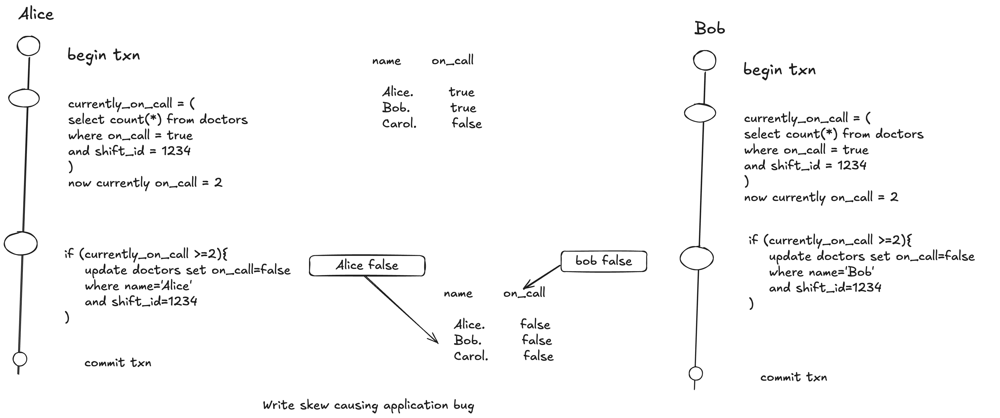

# Write Skew and Phantoms


'

## Characterizing Write skew

- Write skew is a generlization of the lost update problem , Write skew can occur if two txns read the same objects and update some of those objects(different txn may update different objects).

- With write skews options are restircted.

- Atomic single object operations don't help since multiple objects are involved.

- The automatic detection of lost updates doesnt help  as well , write skew is not automatically detected in Postgres repetable read.

- Some database allows to configure constraints which are enforced by the database (eg uniqueness ,foreign constraints or restrictions on a particular value).

- If we can't use serializable isolation level the second best option is to explicitly lock the rows that the txn depends on .

```sql
BEGIN transaction;

SELECT * from doctors where on_call=true
and shift_id=1234 FOR UPDATE;

UPDATE doctors set on_call = false
WHERE name='Alice'
AND shift_id=1234;
COMMIT;
```

## More examples of Write skew

## Meeting review booking System

- We want to enforce that there cannot be two bookings for the same meeting room at the same time.

- When someone wants to mamke a booking, we first check conflicting bookings and if none are found we create a meeting


```sql
BEGIN TRANSACTION

--- Check for overlapping bookings

SELECT COUNT(*) from bookings
where room_id= 123 and end_time='2015-01-01 12:00' and start_time='2015-01-01 13:00';

-- If previous query returned zero

INSERT INTO bookings(room_id,start_time,end_time,user_id) VALUES(123,'2015-01-01 12:00','2015-01-01 13:00','2015-01-01 13:00',666);

COMMIT
```

- Snapshot isolation doesn't prevent another user from concurrently inserting a conflicting meeting.We need serializable isolation for scheduling conflicts.

## Claiming a username

- On a site where each user has a unique username , two users may try to create account with same username at the same time.

- We may create a txn to check whether a name is taken or not , create an account with that name.

- A unique constraint is the simple solution here (the second txn trying to register the username will be aborted due to violating constraint).


## Preventing double spending

- A service that allows user to spend money or point needs to check that user doesn't spend more than they have. With write skew when tallying the balance it it possible to go for negative.


## Phantoms causing write skew

- The effect where a write in one transaction changes the result of a search query in other transaction is called **Phanthom** .

- Snapshot isolation avoids phantom in ready only queries but in read-write txn the phantom can lead to trickier case of write skew.

## Materializing Conflicts

- If the problem of phantoms is that there is no object to which we can attach locks , we can artificially introduce lock object into the database.

- For example in a meeting room booking we can create a table of time slots and rooms. 

- Each row in table corresponds to a particular room for a particular time period (say 15mins). We create rows for all possible combinations of rooms and time period ahead of time, for eg next six months.

- Now a txn that wants to create booking can lock (``SELECT FOR UPDATE``) the rows in the table correspond to desired room and time period.

- After it has acquired the locks we can check for overlapping bookings and insert new bookings as before. 

- Note that additional information is not used to store information about the booking , it is purely collection of locks which is used to prevent bookings on the same room and time range from being modified concurrently.

- This approach is called ``materializing conflicts`` because it takes a phantom and turns it into a lock conflict on concrete set of rows that exist in database. 

- It should be considered as last resort for dealing write skew , serializability is the best choice.


