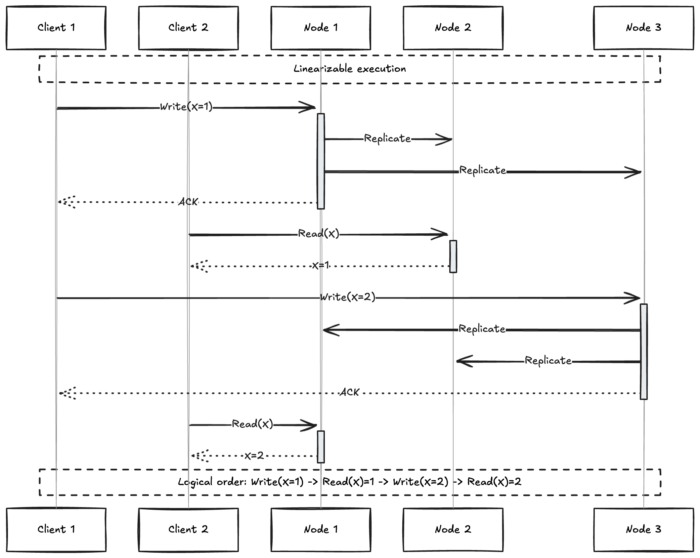

# Linarizability

- Database gives a illusion that there is only one replica .So that every client would have the same view of the data and don't need to worry about replication lag. This is the idea behind **linearizability**, **atomic consistency**.

- In linearizalbe system , if one client finishes the write all other clients in the cluster must be able to read the data that was writeen.

- Maintaining an illusion of single copy of data means guaranteeing the value read is the most recent upto date value and doesn't come from stale cache or replica.

## What makes system Linearizable?


- In this example the register has two types of operation

**read(x)** = > v means the client requested to read the value of register x and database returned the 
value v

**write(x,v)**  => r means the client requested to set the register x to value v and the database returned response r


The value of x is initially 0 and client C performs a write request to set it to 1 . While this is happening clients A and B are repeatedly polling the database to read the lates value. What are the possible
responses that A and B

## Possible responses 

- The first read op completes before the client writes so it returns the old value 0

- The last read by client A begins after the write has completed, It will return the new value 1 if database
is linearizable. We know that the write must have been processed sometime between the start and end of write OP and read must have been processed sometime between the start and end of the read op.If read started
after write ended , then the read must have been processed after write and it must see new value writeen.

- Any read OP that overlaps with write OP must return either 0 or 1 , because we don't know whether or not write has taken effect at the time when read is processed .These OP's are **concurrent** with write.


- In linearizable system we imagine there must be some point in time (between start and end of write OP) which value of x atomically flips from 0 to 1. Thus if one client read returns the new value 1, all subsequent reads must also return new value, even if the write OP has not been completed.

- ``cas(x,vold, vnew)``=> r means client requested an atomic  ``compare-and-set`` operation, if the current value of register x is equal to vold set it should atomically set to vnew, if vold != x, than the op should leave the register unchanged return an error.




## Linearizability Vs Serializability

**Serializability**
    - Serializability is an isolation property of transactions , where every txn may read and write 
    multiple objects.
    - It guarantees that txn behave the same as if they had executed in some serial order.
    - It is okay for the serial order to be different than the order txns are actually run.


**Linearizability**
    - Linearizability is recency guarantee on reads and writes of a register.
    - It doesn't group operations together into txns.
    - It doesn't prevent problem such as write skew and phantom unless we are materializing conflicts


- A datbase may provide both linearizability and seriazlizability, this combination known as strict serializability or strong one copy serializability.


**Linearizability** is a consistency property of concurrent systems. It ensures that the operations on a shared object appear to execute atomically and in some order that is consistent with the real-time order of operations. In simpler terms, it guarantees that the results of operations are as if they were executed one at a time, in some sequence, respecting the order in which non-overlapping operations occur.

### Key Features of Linearizability:
1. **Atomicity**: Each operation seems to take effect instantaneously at some point between its invocation and response.
2. **Real-Time Order**: If one operation completes before another starts, their order is preserved in the sequence.

---

### Example: Linearizability in a Concurrent Counter

Consider a simple shared counter that supports two operations:
1. **`increment()`**: Increases the counter by 1.
2. **`get()`**: Reads the current value of the counter.

#### Initial State:
Counter = 0

#### Scenario:
Two threads, **Thread A** and **Thread B**, perform the following operations:
1. **Thread A**: Calls `increment()` at time \( t_1 \) and completes at \( t_3 \).
2. **Thread B**: Calls `get()` at time \( t_2 \) (after \( t_1 \) and before \( t_3 \)) and completes at \( t_4 \).

---

### Possible Behaviors:
#### **Linearizable Execution (Valid):**
- **Real-Time Order is Preserved**:
    - The `increment()` from Thread A takes effect before the `get()` from Thread B.
    - Result of `get()` is 1.
- **Possible Sequence**:
    1. \( t_1 \): Thread A calls `increment()` (Counter = 0).
    2. \( t_2 \): Thread B calls `get()` (Counter = 1 due to the completion of increment).
    3. \( t_3 \): Thread A completes `increment()`.

#### **Non-Linearizable Execution (Invalid):**
- **Real-Time Order is Violated**:
    - `get()` returns 0 even though it occurs after the `increment()` call from Thread A.
    - This outcome is not linearizable because it implies the `increment()` hasn't taken effect even after `get()`.

---

### Visualization: Linearizability with Timelines
```plaintext
Time Line:
t1    t2         t3         t4
|-----|----------|----------|
A: increment()-------------->
B:        get()------------->
```

#### Linearizable Outcome:
- `increment()` (Thread A) appears to happen before `get()` (Thread B), as reflected in the result of `get()`.

---

### Application of Linearizability:
Linearizability is crucial in distributed systems and databases where consistency is essential. For example:
- **Distributed Databases**: Ensures that a write operation (e.g., updating a value) is visible to all subsequent read operations.
- **Lock-Free Data Structures**: Guarantees correct behavior even when multiple threads access shared objects concurrently.
