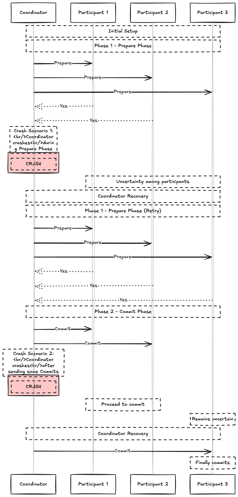

# Two Phase Commit

- It is an algorithm to achieve atomic txn commit across all multiple nodes, ensure that either all nodes commit or all nodes abort. 

- The commit/abort process in 2PC is split into two phases.

- 2PC has assigned a node as **coordinator** or **transaction manager** which orchestrates the whole transaction process.

- When 2PC is used ,  a distributed txn begins with application reading and writing data on multiple nodes,  as normal.

- We call the database nodes **participants** in the transaction.

- When the coordinator is ready to commit , the coordinator begins phase1, it sends a prepare request to each of the nodes asking whether they are able to commit. The coordinator then tracks the responses from the participants
    - If all ps reply "yes" indicating they are ready to commit, then the coordinator sends commit request in phase 2 and the commit actually takes place.

    - if any of the participants replies no the coordniator sends an abort request to all nodes

##  A system of promises

-  When the application want to begin a distributed txn  it requests a txnID from the coordinator . This txn id is globally unique.

- The application begins a single node txn on each of the participants and attaches the globally unique txn id on the single node txn.

- All reads and writes are done in one of these single node txns. If anything goes wrong at this stage , The any of participants  and coordinator can abort.

- When the application is ready to commit , the coordinator sends a prepare request to all participants, tagged with the global txn id. If any of these requests fails or timesout the cordinator sends are abort request for the txn id to all the participants.

- When participant receives the prepare request it makes sure that it can definitely commit the txn under all circumstances. This includes writing all data to disk and checking for any conflict or violatoions. By replying yes to the coordinator the node promises to commit the txn without error if requested. 

- When the coordinator has received responses to all prepare reuqests it makes a definitive decision to commit or abort txn (only commit when all participant voted yes). The coordinator must write the decision to its txn log on disk, so that it knows which way it decided in case it subsequently crashes. this called **commit point**.

- Once the coordinator decision has been written to disk , the commit or abort req is sent to all participants, if the request fails or timeout the cordinator must retry forever until it succeeds. There is no going back if the decision was to commit , the decision must be enforced no matter how many retries it takes if the participant has crashed in meantime the txn will be committed when it recovers.if voted yes it cannot refuse to commit.

## Coordinator failure

- If the participant has recieved a prepare request and participant has replied yes to the cordinator it cannot take action by itself.

- It should recieve the decision to either commit or abort from the coordinator and if the cordinagtor crashes the participant can do nothing but wait. A participant in this state is called **in doubt** or **uncertain**.

