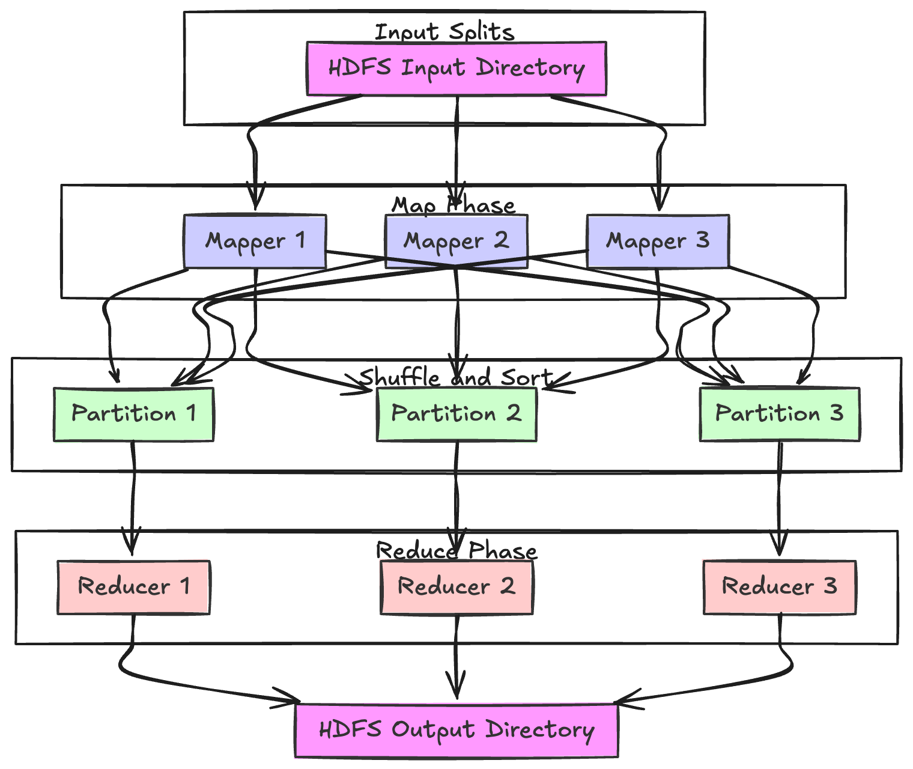

# MapReduce Job Execution

- MapReduce is a programming framework which we can write code to process large dataset in distributed filesystem like HDFS. 

## Pattern

- Read a set of input files and break it up into **records** , In the web server log example each record is one line in the log.

- Call the **mapper** fn to extract a key and value from each input record.

- Sort all of key-value pairs by key. 

- Call the **reducer** fn to iterate over the sorted key value pairs. If there are multiple occurences of the same key , the sorting has made them adjacent in list . it is easy to combine them without having to keep lot of state in memory.

## Mapper

- The mapper is called once for every input record and its job is to extract key value from the input record.

- For each input it may generate any number of key-value pairs(including none). It does not keep any state from one input record to the next , so each record is handled independtly.

## Reducer

-It takes the kv pairs produced by the mappers collects all the values belonging to the same key and calls the reducer with an iterator over that collection of values.

- The reducer can produce output records (such as no of occurences of same url)




## Sample job


**Scenario:**  
A large e-commerce platform wants to analyze its server logs to identify the number of unique visitors per day. These logs are stored in HDFS and are massive in size, making them ideal for distributed processing with MapReduce.

---

**Input:**  
- Server log files stored in HDFS with entries in this format:  
  ```
  2024-12-28T14:35:12 user12345 page1
  2024-12-28T14:37:10 user67890 page2
  ```

---

**Steps:**

1. **Map Phase:**  
   - Each mapper processes a chunk of log data.
   - It extracts the **date** and **user ID** and outputs a key-value pair:  
     ```
     Key: (date, user_id)
     Value: 1
     ```

   Example Output:  
   ```
   (2024-12-28, user12345) -> 1  
   (2024-12-28, user67890) -> 1  
   ```

2. **Shuffle and Sort:**  
   - Key-value pairs are grouped by key (date, user_id).
   - This ensures all data related to a specific date and user is sent to the same reducer.

3. **Reduce Phase:**  
   - Reducers process grouped data.
   - For each key `(date, user_id)`, the reducer aggregates and emits:  
     ```
     Key: date  
     Value: set(user_ids)
     ```

   Example Output (simplified):  
   ```
   (2024-12-28) -> {user12345, user67890}
   ```

   Finally, the size of the set for each date gives the **unique visitors count per day**.

---

**Output:**  
- An HDFS file containing the number of unique visitors per day:  
  ```
  2024-12-28 -> 250,000 unique visitors  
  2024-12-29 -> 300,000 unique visitors  
  ```

---

**Advantages:**  
- Efficient handling of massive datasets distributed across multiple nodes.
- Scalable for real-time updates with incremental log files.

