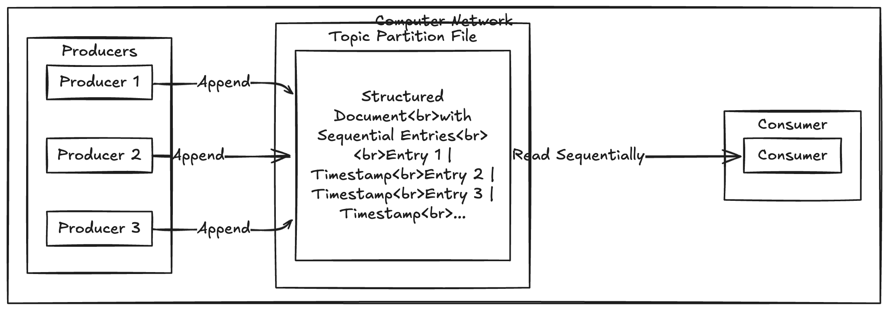

# Message Brokers

- Widely used alternative is to send message via message broker/queue which is kind of DB optimised for handling message streams.

- It runs a server with producers and consumers to it connecting as clients . Producer writes messages to broker and the consumer receive them by reading from the broker.

- By centralization these systems can easily tolerate clients that come and go and durability responsibility is to broker.

- Queueing helps the consumers to process data asynchornously, Eventually message will be delivered to  consumer once it come backs online.

## Multiple Consumers

- When multiple consumers read message from same topic , Two main patters of messaging are used
    - Load Balancing
    - Fan-out

## Load Balancing

- Each message is delivered to one of the consumers so the consumers can share work of processing the messages in the topic. 

- The broker may assign messages to consumers arbitarily.

- This pattern is useful when the messages are expensive to process and we want to able to add consumers to parallelize the processing.

## Fan-Out

- Each message is delivered to all of the consumers

- Fan-out allows several independent consumers to each tune-in to the same broadcast of messages without affecting each other, 

## Acknowledgments and redelivery

- Consumers may crash at any time so it could happen that a broker delivers a message to consumer and consumer never process the message or only partially processes it.

- In order to ensure messages doesn't get lost , broker uses the concept of **acknowledgment**.

- Client must tell the consumer explicitly when the message has processed so the broken can remove the message from the queue.

- If the client connection is closed out without broker receiving an ACK , it assumes that the message was not processed and delivers the message to another consumer.

- The combination of load balancing with redelivery inevitably leads to messages being reordered.AMPQ standards required ordering

- To avoid this issue can use a seperate queue per consumer. Message reordering is important if the messages have casual dependency among themselves.

## Logs for message storage

- Producer sends a message by appending it to the end of the log and consumer receives a messages by reading the log sequentially.

- If a consumer reaches the end of the log , it waits for a notif of new message has been appended.

- In order to scale for high throughput , the log can be partitioned.

- Diff partitions can be hosted on diff machines making each partition a seperate log that can be read and written independently from other partitions.

- A topic is defined as group of partitions that carry all  messages of same type.

- With each partition the broker assigns a monotonically increasing seq number or offset to every message. Such a seq number makes sense because a partition is append only so the messages within a partition are totally ordered. 

## Logs compared to traditional messaging

- The log based approach trivially supports fan-out messaging because several consumers can independently read the log without affecting each other.

- To acheive load balancing across a group of consumers instead of assigning individual messages to consumer clients the brokers can assign entires partition to node in consumer group.

- Each client consumes all the messages in the partition it has been assinged.

- When a consumer is assigned to a log partition, it reads the message in partitions sequentially in a straight forward single threaded manner.

- When we need higher throughput better to use AMPQ style messaging instea of log based approach when message ordering is important then it can be ised.

- All messages that need to be ordered consistently need to be routed to same partition.

## Disk Space usage

- If we only ever append to the log, we will eventually run out of disk space.

- To reclaim the disk space the log is actually divided into segments and from time to time old segments are deleted or moved to archived storage.

## Replaying old messages

 - For replaying old messages log based messaging is helpful.

 - An offset can be specified from which the consumer needs to read and replay the workflow like batch processing.

 