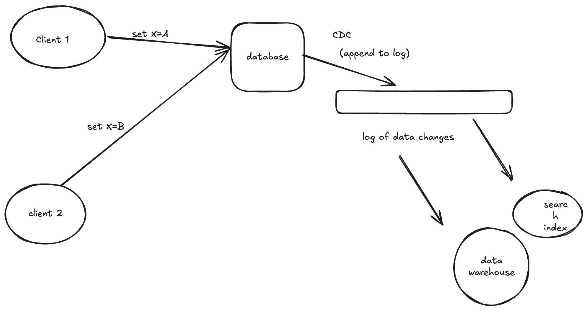

# Change Data Capture

- Database replication logs are considered to be internal implementation detail of database and not an public API. 

- Clients are supposed to query the database using its data model and query language ,not parse the application logs and try to extract from them.

- **Change Data Capture (CDC)** is a process of observing all data changes written to a database and extracting them in a form which they can be replicated to other systems.  CDC is especially interesting if changes are made available as stream immediately as they are written.

- Eg if we can capture the changes in database and continually apply the same changes to search index. if the log is applied in the same order , we can expect the data in search index to match data in database.

- The search index and other derived data systems are just consumers of the change stream, such as consistent.

## Implementing change data capture

- The log consumers are called **derived data systems**.

- CDC is mechanism for ensuring that all the changes made to system of record are also reflected in the derived data systems so that the derived systems have accurate copy of data.

- In CDC one database is made as leader and rest as followers.

- A log based message broker is well suited for transporting the change events from source DB to derived systems in an ordered manner.

- CDC is asynchornous the system of record db doesn;t wait for the changes to be applied to consumer before commiting it. 

## Initial Snapshot

- If we have the log of all changes made to database we can reconstruct the entire state of database by replaying the log.

- If we keep all the logs it takes time and requires more storage so it needs to be truncated.

## Log Compaction

- The principle is the storage engine periodically looks for log records with the same key throws away any duplicates and keeps only most recent update for each key. This compaction and merging process runs in background.

- In log storage engine a update with special null value (a tombstone) indicates that key was deleted and causes it to remove during log compaction. 

- But as soon as it is not overwritten or deleted it stays in the log forever. 

- The logs have necessary info to rebuild the database to the current state , rest of the old values will be garbage collected. 

