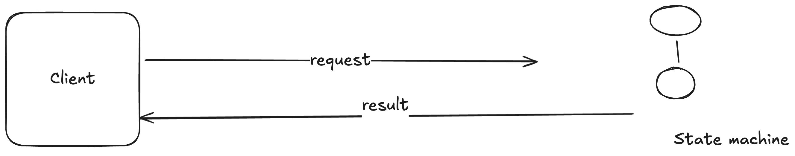
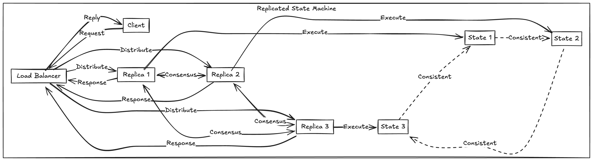
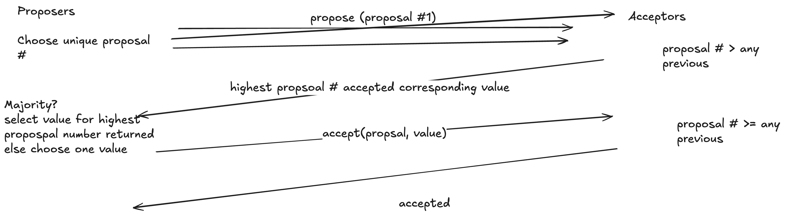

# Raft Consensus Algorithm

- In case of leadered replication , primary-master replication there is a single node which makes decision on who becomes leader , processing writes etc , But that in itself is a single point of failure

## Consensus

- Allows collection of machines to worktogether as a coherent group

- Continous service , even if some machine fails

- Paxos, hard to understand not enough real implementations

- Raft , primary design goal understandability 

- Complete foundation of implementation, Different problem of decomposition

## State machine

- Responds to external stiumli

- Manages internal state

Example : Memcached, RAM Cloud

## Replicated State Machines

- **Replicated log** ensures that state machine execute same commands in same order

- **Consensus** module ensures proper log replication

- System makes progress as long as majority of servers are up

- **Failure model** delayed/lost messages fail stop (not byzantine)

**Byzantine Failure**
- Byzantine failure refers to a type of fault in a distributed system where a component, such as a server or process, fails in an arbitrary or malicious manner.

- These protocols ensure that the system can tolerate up to a certain number of faulty nodes (e.g f faulty nodes out of 3f+1 nodes)

**Fail Stop**

A fail-stop failure is a type of fault in a distributed system where a component, such as a server or process, stops functioning altogether but does so in a predictable and detectable manner. 

## Paxos (Single decree)

## Problems with Paxos

- Impenetrable hard to develop intuitions
    - Why does it work
    - What is the purpose of each phase

- Incomplete
    - Only agrees on single value
    - Doesn't address liveliness
    - Choosing proposal values?
    - Cluster membership management

- Ineffcient
    - Two rounds of messages to choose one value

- No agreement on the details

- Not a good foundation for pratical implementations

