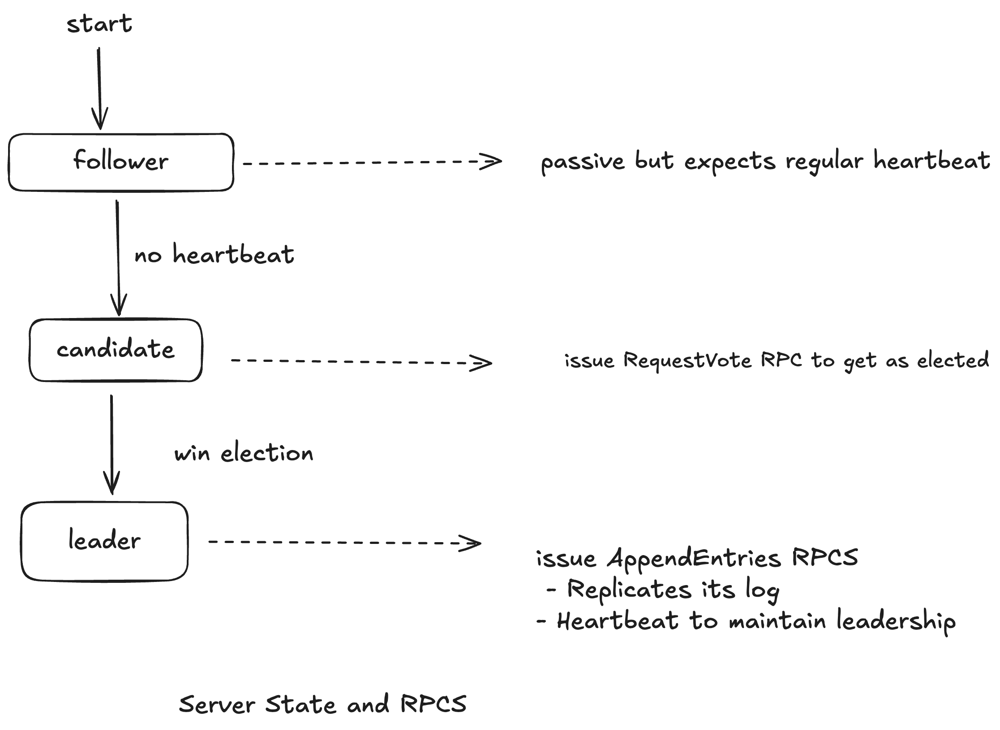
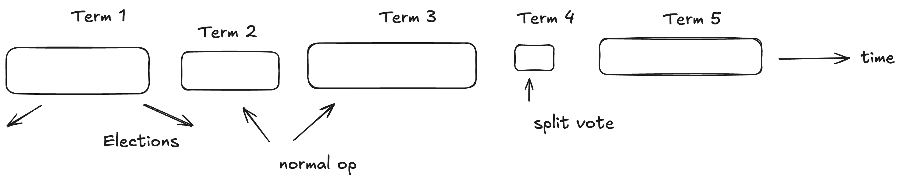
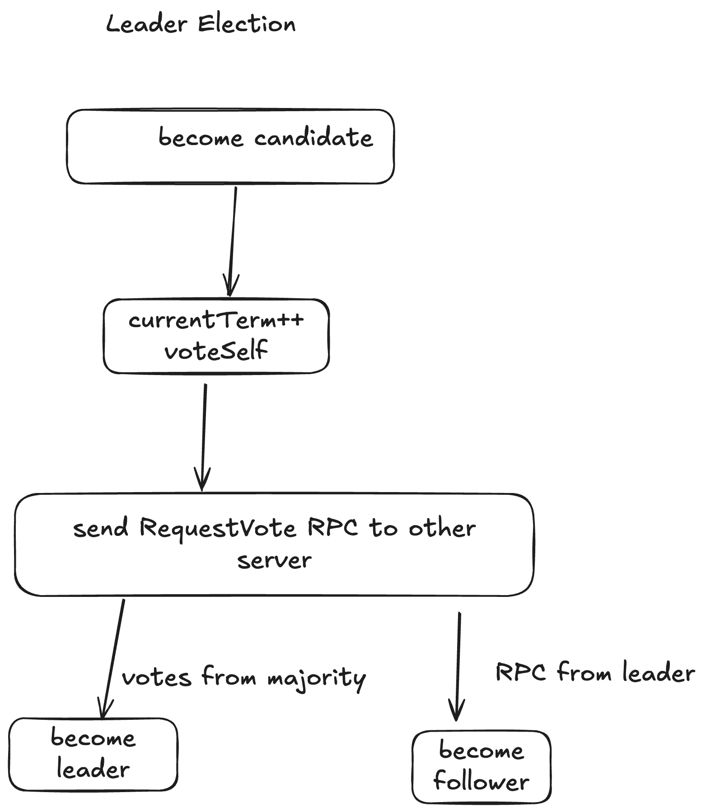
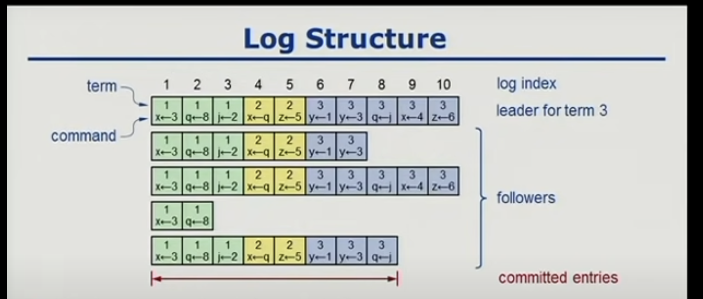
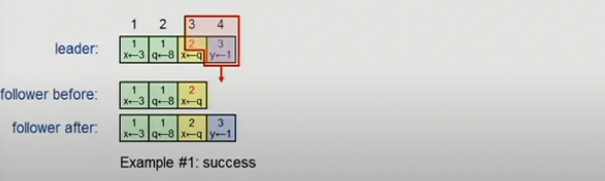

# Raft Consensus Algorithm

- In case of leadered replication , primary-master replication there is a single node which makes decision on who becomes leader , processing writes etc , But that in itself is a single point of failure

## Consensus

- Allows collection of machines to worktogether as a coherent group

- Continous service , even if some machine fails

- Paxos, hard to understand not enough real implementations

- Raft , primary design goal understandability 

- Complete foundation of implementation, Different problem of decomposition

## State machine

- Responds to external stiumli

- Manages internal state

Example : Memcached, RAM Cloud

## Replicated State Machines

- **Replicated log** ensures that state machine execute same commands in same order

- **Consensus** module ensures proper log replication

- System makes progress as long as majority of servers are up

- **Failure model** delayed/lost messages fail stop (not byzantine)

**Byzantine Failure**
- Byzantine failure refers to a type of fault in a distributed system where a component, such as a server or process, fails in an arbitrary or malicious manner.

- These protocols ensure that the system can tolerate up to a certain number of faulty nodes (e.g f faulty nodes out of 3f+1 nodes)

**Fail Stop**

A fail-stop failure is a type of fault in a distributed system where a component, such as a server or process, stops functioning altogether but does so in a predictable and detectable manner. 

## Paxos (Single decree)

## Problems with Paxos

- Impenetrable hard to develop intuitions
    - Why does it work
    - What is the purpose of each phase

- Incomplete
    - Only agrees on single value
    - Doesn't address liveliness
    - Choosing proposal values?
    - Cluster membership management

- Ineffcient
    - Two rounds of messages to choose one value

- No agreement on the details

- Not a good foundation for pratical implementations

## Raft decomposition

**Leader Election**

- Select a server to act as a leader

- Detects crashes , Chooses new leader

**Log replication(normal operation)**

- Leader accepts command from clients , appends it to log

- Leader replicates its log 

**Safety**

- Keep logs consistent

- Only servers with up-to date logs can become leader

## Server States and RPCs

## Terms 

- In order to do consensus we need to have a way to determine obselete information

- Atmost 1 leader per term

- Some terms have no leader (failed election)

- Time is split into terms

- Each items maintain current term value (no global view)
    - Exchanged in every RPC
    - Peer has later term ? Update term revert to follower
    - Incoming RPC has obselete term , reply with error

- Terms identify obselete information

## Leader Election

## Election correctness

**Safety** 
    - Allow atmost one winner per term   
    - Each server gives only one vote per term (persistent on disk)
    - Majority required to win 

**Liveness**

- Some candidate must eventually win 

- Choose election timeouts randomly in ``[T,2T]`` (eg:150-300ms)

- One server usually times out and wins electio before others timeout

- Works well if T >> broadcast time

- Randomized approach simpler than ranking

## Normal operation

- Client sends command to leader

- Leader appends commands to its log

- Leader sends ``AppendEntriesRPC`` to all followers 

- Once new entry **committed**
    - Leader executes commands in its state machine and sends results to client

    - Leaders notifies followers of commited entires is subsequent ``AppendEntriesRPC``

    - Follower executes committed commands in their state machines

- Crashed/slow followers?
    - Leader retries append entry RPCS until they succeed

- Optimal performance in common case
    - One successful rpc to majority of servers

## Log structure

- Must survive crashes (store on disk)

- Entry committed if safe to execute in state machines
    - Replicated in majority of servers by leader of its term

## Log inconsistencies

- Crashes can result in log inconsistencies

- Leader assumes its log is correct

- Normal OP will repair all inconsistencies

## Log matching property

- Goal: High level of consistency between logs
    - If log entries on different servers have same index and term
        - They store the same command
        - The logs are identical in preceeding entries

- If given entry is committed all preceeding entries are also committed.

## Append Entry consistency check

- **AppendEntries** RPC includes ``<index,term>`` of entry preceeding new ones

- Follower must contain matching entry, otherwise it rejects request.
    - Leader retries with lower log index

- Implements **induction step** log matching property

## Leader completeness

- Once log entry committed all the future leaders must store that entry

- Server with incomplete logs must not get elected
    - Candidates include index and term of last log entry in ``RequestVote`` RPCS
    
    - Voting server denies vote if log is more up-to date.

    - Logs ranked by ``<lastTerm, lastIndex>``
